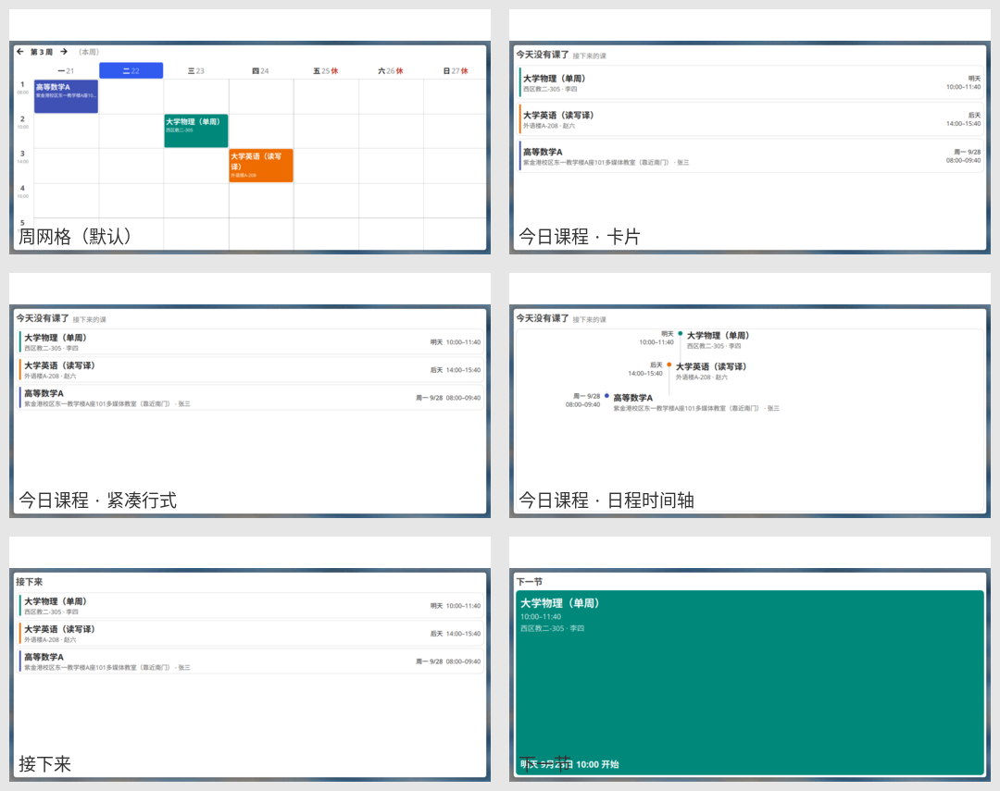

# 课程表 (Timetable)

KDE Plasma 6 的桌面课表组件。默认是 7 列 × 节次的周网格，也能切成
「今日课程 / 接下来 / 下一节」三种列表样式（列表还能再选卡片、紧凑行式、
日程时间轴三种版式）。高亮今天与当前课程，标出法定节假日与调休，
背景和卡片的不透明度都能单独调。



> 上图（用仓库里 `tests/sample.ics` 的示例课表渲染）：
> 第一行 —— 周网格（默认）、今日课程 · 卡片；
> 第二行 —— 今日课程 · 紧凑行式、今日课程 · 日程时间轴；
> 第三行 —— 接下来、下一节。
> 列表样式在「今天没有课了」时会自动往后接几节，卡片上的日期写成
> 「明天 / 后天 / 下周三 9/30」（同一门课每周都上，只写星期几分不清是哪一周）。

## 为什么会有这个东西

KDE Store 上没有课程表组件（`timetable` / `schedule` / `class` / `课程表` 四个词都搜过，
只有公交时刻表和一个 Plasma 4 时代的单一学校补课工具）。ClassIsland 只支持 X11，
Class Widgets 是独立的 PyQt 程序、不是 Plasma 组件。所以对 Wayland + Plasma 6 来说，
确实没有能用的。

## 三种录入方式

导入会**替换**现有全部课程，所以手工加过的课请先留档（配置页最下方可以复制当前数据）。

### 1. 手动录入

配置页 → 「添加一节课」，然后填课程名、星期、起止节次、周次、地点、教师。

周次支持这几种写法，可以混用：

| 写法 | 含义 |
|------|------|
| `1-16` | 第 1 到 16 周 |
| `1,3,5` | 只在这些周 |
| `1-16单` | 1 到 16 周里的单周 |
| `1-16双` | 双周 |

懒得算单双周，就用周次右边的**单双周下拉框**（每周 / 仅单周 / 仅双周）：
它会按当前的起止周自动填好。比如周次填了 `1-16`，选「仅单周」就变成 `1-16单`。

起止周会单独记下来，所以反复切换单双周不会让范围缩水
（`1-16 → 仅单周 → 仅双周 → 每周` 仍然回到 `1-16`，不会变成 `2-14`）。

### 2. 导入 ICS（推荐）

教务系统或日历导出的 `.ics` 文件。**用文本编辑器打开，全选复制，粘贴到配置页的
「ICS 日历」框里。**

能自动处理：开学日（按最早的课推断）、单双周（`RRULE` 的 `INTERVAL=2`）、
停课（`EXDATE`）、整天事件（考试这类会被跳过）、跨行折行、引号与转义。
作息时间表也会从 ICS 里推出来（每个不同的上课时段算一行），之后可以在配置页里改。

这条路在国内高校是通的：zju-ical、fzu-ics、uestc-coursetable-parser、Class2ICS、
GTMD 青果、人大的浏览器扩展等等，都能把教务系统的课表转成 `.ics`。

### 3. 导入 WakeUp 课程表

WakeUp → 分享 → 导出备份，得到 `.wakeup_schedule` 文件。同样是打开、全选、粘贴，
选「WakeUp 课程表」那个页签。

这个格式**自带作息时间表和开学日期**，所以导入之后不需要再配任何东西。
`type` 字段的 0/1/2 分别是每周/单周/双周，直接对应；`ownTime` 的自定义时间课程会被跳过。

### 为什么只能粘贴，不能选文件

QML 读不了本地文件 —— `XMLHttpRequest` 的 `file://` 被安全策略拦着，没有别的入口。
与其做一个在别人机器上打不开的文件对话框，不如只留一条一定能用的路。
`.ics` 和 `.wakeup_schedule` 都是纯文本，用文本编辑器打开即可。

### 中文与编码

中文本身没问题：中文课名、教师、地点，中文的 `TZID`，全角括号和正文里的全角冒号
都按原样处理。另外还兼容两种国内很常见的情况：

- **全角冒号**。从网页或聊天记录里复制 ICS 时，中文输入法常把 `:` 打成 `：`，
  一整份文件就都解析不出来了。现在两种冒号都认（取第一个，所以
  `DESCRIPTION:教师：张三` 里正文的全角冒号会原样保留）。
- **带 BOM 的文件**也能直接粘。

**编码不对会被拦下，而不是静默导入乱码。** 教务系统导出的文件常常是 GBK / GB18030，
如果用按 UTF-8 打开的编辑器复制出来，中文会变成 `é«æ°å¦` 这种。这种文件
**解析器不会报错**（`BEGIN`/`END`、属性名都是 ASCII，结构照样解析得出来），
结果是拿到一份「看起来正常、课名全错」的课表，比直接失败糟得多。
所以导入前会先检查，发现就明确告诉你：

> 这份内容的中文部分已经是乱码了……请用文本编辑器把原文件按 GBK 或 GB18030 打开，
> 确认中文显示正常之后再复制粘贴。

## 学期

- 学期进行中：工具条显示「第 N 周（本周）」
- **学期结束**后：显示「第 N 周（本学期已结束）」，周次夹在最后一周，
  「下一周」按钮禁用，面板上也直接显示「本学期已结束」—— 翻不到学期外的空周
- 开学之前：显示「（尚未开学）」

「回到本周」按钮在学期结束后会变成「回到最后一周」。

### 「非本周」的课会灰显

学期结束后那副样子看起来和平时一模一样 —— 容易让人以为还要去上课。所以：

- 当显示的这一周**不是本周**时（翻到别的周、或者学期已经结束），
  整张表的课块都会变成灰暗色并标注「非本周」
- **不在本周上的课**（比如只在第 11 周开一次的讲座，而你在看第 3 周）
  默认不画出来；配置里打开「显示不在本周上的课」后，会画出来并同样灰显标注

灰显用的是原色往中性灰里混七成、保留三成色相 —— 一眼能看出「不用上课」，
又还认得出是哪一门课（全灰成一片反而分不出）。

## 本机时间被改动怎么办

「今天是第几周」完全依赖本机时间：把系统时间改早两周，看到的就会是错的那一周的课；
改早几年，还会显示成「尚未开学」。所以组件会**定期把本机时钟和网络时间对一次**：

- 每隔 6 小时（以及每次启动）取一次服务端响应里的 `Date` 头，算出差值
- 差值超过一天才启用校正，并记进配置（显示时用「本机时间 + 差值」）
- 此时工具栏会显示 **⚠ 时间已校正**，悬停可以看到相差多少天

几个刻意的取舍：

- **偏差小于一天不校正。** 那多半只是走时漂移，校正反而每次都对不上整秒，让人以为坏了。
- **断网不清除已有校正。** 本机时钟的走时是准的，不准的只是偏移量，
  所以算过一次就够用；没网时维持原值，不会退回错误时间。
- **只读响应头，不因此上传任何东西。** 请求的就是节假日数据本身那两个地址。
- **仍以本机时间为主。** 只有确实测出超过一天的偏差才改显示 ——
  组件不是时间服务，不该在没事的时候也和系统时钟唱反调。

## 节假日与调休

节假日数据与[农历月历组件](https://github.com/helloydh007/plasma-lunar-calendar)同源：
内置数据表 + 联网更新（可设为手动或每 30 天自动检查）。放假安排由国务院逐年发文规定，
无法由历法推算，所以必须用数据表。

- **休**：那天不排课，格子标红「休」
- **班**：调休上班日，标灰「班」

「班」只是个提示，**不会改变课表** —— 那天仍按它本身的星期几显示课程。
调休到底补哪一天的课各校不同、国家也不规定，所以不做猜测；要按别的星期几上课，
把对应的课在课程表里加一条即可。

## 显示样式

「外观」页里可以切换四种样式（也是同类应用常见的几种：WakeUp 课程表提供的就是
日视图 / 周视图 / 今日课程 / 近日课程）：

| 样式 | 长什么样 | 什么时候用 |
|------|---------|-----------|
| **周网格**（默认） | 七列 × 节次的整周课表 | 看全一周、排计划 |
| **今日课程** | 只列今天的课，一行一门 | 桌面上一瞥就够；今天的课上完后会自动接上最近的一节（见下） |
| **接下来** | 从今天起往后几门，跨天标「明天」「下周三 9/30」 | 想知道「接下来还有什么」 |
| **下一节** | 只显示当前或接下来那一节，大字加倒计时 | 占地方最小 |

正在上的那一节会用主题高亮色整块点亮，右上角标「上课中」（判据是「既是今天的、
现在又落在它的起止时间之间」，两个条件缺一不可 —— 只看时间的话，明天同一时间的课
会被误判成正在上）。已经上完的课不会列出来。

**跨天的卡片一定带日期**。同一门课每周都上，往后看两周时「本周三」和「下周三」的两节
会挨在一起，名称和时间一模一样，只写「周三」根本分不清谁是谁（这就是之前那个
「同一门课显示了两遍」）。所以一周以内写「明天 / 后天 / 周四 9/25」，隔周写「下周三 9/30」。

**「今日课程」有回退**：今天还有课就显示今天的；今天没课（或者课上完了），
标题变成「今天没有课了 接下来的课」，往后接**最近的三门**（数量可在「外观」页里改）。
不一定是明天 —— 明天也没课就再往后找，不足这么多就有几门显示几门。

到了那天会自动变成当天的课表（数据是跟着「现在」算的，不需要手动切）。
学期结束则显示「本学期已结束」。

卡片多到放不下时可以滚动（右侧出现滚动条），既不会把卡片压扁、也不会画到组件边框外面。

### 卡片布局

「今日课程」和「接下来」的课程列表有三种版式，在「外观」页的「卡片布局」里切换
（只影响这两个样式；周网格没有列表，「下一节」整块就是一张卡）：

| 布局 | 长什么样 | 什么时候用 |
|------|---------|-----------|
| **卡片**（默认） | 两行：课名在上、地点·教师在下，右上角日期和时间 | 通用；信息最全 |
| **紧凑行式** | 一堂课只占一行（课名 + 日期 + 时间同行） | 组件小的时候：**240×160 下三节课都能露出来**，不用滚 |
| **日程时间轴** | 整条日程一块板：左边日期和时间、中间一条导轨、每门课一个色点 | 扫读节奏快；同样高度下比卡片少显示一节 |

时间轴的行里，「上课中」跟在课名下面（那边没有右边一列可挂）。

面板上的小视图不受这里影响 —— 那里位置太窄，固定显示「现在 / 下一节」；
今天没课了会报出往后最近的一节，和桌面上的列表保持一致。

### 不透明度：底板和卡片分开调

「外观」页里有两个 0–100% 的滑块，互相独立：

- **背景不透明度** —— 组件底板。调到 0 就只剩内容浮在桌面上，完全没有背景板。
- **卡片不透明度** —— 课程卡片的底色（时间轴布局下是整块日程板）。
  调到 0 卡片本身看不见，只剩下文字和左边那条课程色条，
  适合「底板上留一点字」或者「连底板一起关掉、字直接贴在壁纸上」。

**文字和课程色条始终不透明**，只有卡面跟着淡 —— 跟着一起淡的话，
浅色壁纸上课程名会糊成一片读不清（这是刻意的，不是没做完）。
周网格不受这一项影响：那里的课块本身就是色块，调透就没法看了。

背景是组件自己画的（用桌面主题的 `widgets/background` 边框，和桌面容器画的
applet 背景是同一个元素），所以不透明度是准的。代价是组件右键菜单里 Plasma 那个
「背景」开关不再起作用 —— 配置页里有等效且更细的控制。

## 设置

- **开学日**：决定周次和「第几周」的显示。导入 ICS / WakeUp 时会自动填上。
- **学期总周数**：决定「下一周」按钮能翻到哪一周。
- **作息时间表**：每行一节，格式 `节次号 开始-结束`，`#` 开头是注释。网格的行数由它决定。

## 安装

```bash
./install.sh
```

然后桌面右键 → 添加小组件 → 搜索「课程表」。

尺寸：默认拖出来是 860×540，周网格在这个尺寸下最舒服（再小课程名会折行、
地点和教师会按空间自动省略）。**组件缩到 240×160 这种小尺寸也能用** —— 列表样式里把
「卡片布局」切成**紧凑行式**，三节课全都能露出来；周网格那个尺寸下就不建议了。

卸载：

```bash
kpackagetool6 --type Plasma/Applet --remove io.github.helloydh007.timetable
```

## 开发与测试

数据层（模型 + 两个导入器）是纯 JS，可以脱离 Plasma 单独跑：

```bash
node tests/test-importers.js
```

覆盖 229 项断言：ICS 的折行/TZID/单双周/UNTIL/EXDATE、WakeUp 的 type 单双周与
`ownTime` 跳过、两条路径落到同一模型后的网格查询、日期标签与跨周去歧义、坏输入不崩、
以及配置里手改坏 JSON 的降级。

### 两个值得知道的设计决定

**内部完全按具体日期匹配课程，周次只作显示标签。** 导入器把课展开成「第几周 + 星期几」，
但判定某天有没有课走的是日期。这样即使开学日填错，课表上的课也不会跑到别的日子去 ——
错的只会是角落里的周次数字。

**`timetableData` 只归一个配置页所有。** KCM 的每一页各自持有 `cfg_` 属性的副本，
两个页写同一个键，后写的那页会把另一页的改动整个覆盖掉 ——
比如在课程页导入完课表，再去另一页改个设置，导入的课程就没了。
所以开学日、总周数、作息时间表这些导入器会写到的字段，都只能和课程放在同一页。

## 许可

GPL-2.0+，见 [LICENSE](LICENSE)。
